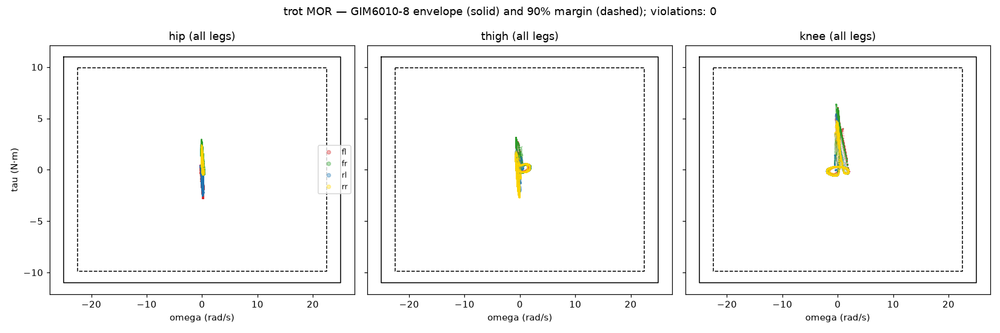

> **This is a curated showcase.** It mirrors selected material from FENRIR's private development repository, for demonstration purposes. The full platform — attachment spec, printable modules, SDK — will be released openly at launch.

# Project FENRIR

FENRIR is a quadruped robot you can take apart **while it is running**. Every
leg is a hot-swappable module that detaches with two connectors and four
bolts; every actuator is a self-announcing node on the bus; every component's
health lives in one seven-state machine that the bay LEDs render in light.
Pull a leg mid-operation and its bay goes red while the robot keeps its feet.
Plug it back in and you can watch discovery bring it home: red, amber pulse,
green. All of the AI — vision, voice, command understanding — runs locally on
the robot. It is built by [Vardr Labs](https://vardrlabs.com) as the
reference platform for an open modular-robotics SDK.

## Status — what provably works today

Hardware arrives late July 2026. Everything below is real, current, and
verified — the badge above runs the production kinematics test suite on
every push:

- **Closed-form leg kinematics**, verified at machine precision: 10,000
  round trips at ~3×10⁻¹⁶ m, analytic Jacobian against finite differences,
  closed-form determinant, statics against hand calculation. The exact
  production module and suite are in [`kinematics/`](kinematics/).
- **Full-quadruped simulation that walks**, generated from the robot's
  single source-of-truth configuration. Simulated foot positions match the
  analytic solution to 4.7×10⁻¹⁶ m before any gait is trusted.
- **Trot and crawl on flat ground**, open-loop, with per-leg liveness
  assertions in CI — a foot that drags instead of stepping fails the build.
- **Motor-envelope validation on every rollout** (torque-velocity
  containment, thermal budget, cost of transport), which caught two
  overload conditions in simulation before the remaining actuators were
  purchased.
- **Firmware skeleton for the real-time layer**: 16 hardware-free native
  tests and a compiling embedded target, in CI.

**Trot** (12 color-coded joints, fixed + tracking cameras):

https://github.com/vardrlabs/fenrir-showcase/raw/main/docs/media/trot.mp4

**Crawl** (statically stable gait, lateral body-shift choreography):

https://github.com/vardrlabs/fenrir-showcase/raw/main/docs/media/crawl.mp4

Motor operating region, every joint, full rollout — the trajectories stay
deep inside the actuator envelope:

## How this gets built

FENRIR is developed by one engineer working with Anthropic's Claude as a
day-to-day engineering partner: Fable 5 in design sessions, Claude Code at
the keyboard for implementation. The derivations, the specs, the firmware,
and most of the code in this repository were produced inside that
collaboration. Nothing here is trusted because of who wrote it, human or
AI. Every artifact runs the same gauntlet before it lands: closed-form hand
checks, symbolic re-derivation, finite-difference validation, per-leg
liveness assertions in simulation, and a 69-item repository audit. The
architecture, the decisions, the hardware, and the mistakes are mine. The
rigor is the point; authorship is a detail.

## Dig deeper

- [Architecture](docs/ARCHITECTURE.md) — three layers, two CAN buses, four
  hot-swap bays, one health vocabulary, local-first AI stack.
- [Bill of materials](docs/BOM.md) — every component, exact variants,
  quantities, and status, down to the fuses.
- [Milestones](docs/MILESTONES.md) — dated, verified results from the
  build log.
- [`common/component_state.h`](common/component_state.h) — the seven-state
  health enum, as it ships.

## The open platform

At launch, FENRIR releases as an open platform: the attachment spec, the
printable module designs, and the SDK that makes a third-party attachment a
config entry plus a driver node. The robot is the demo; the SDK, protocols,
and modularity are the product. Follow along at
[vardrlabs.com/fenrir](https://vardrlabs.com/fenrir).

## License

No license is granted yet. All rights reserved during development. The
platform releases under open licenses at public launch (software:
Apache-2.0 planned; hardware: CERN-OHL-P planned).

---

*This repository is manually curated from the private development repo at
milestones. Last updated: 2026-07-17.*
