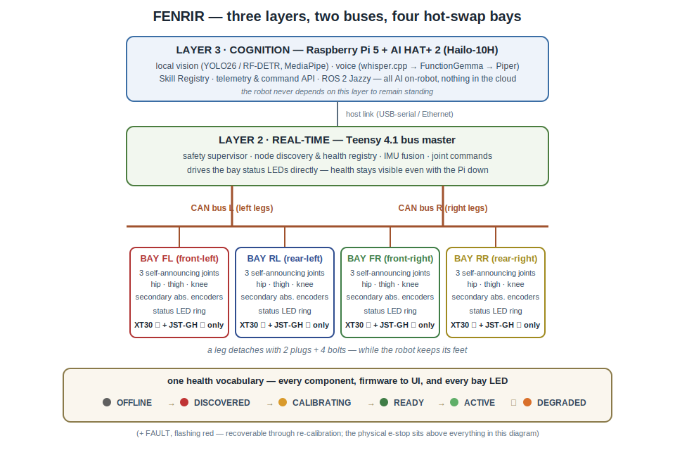

# FENRIR architecture

Block-diagram-level overview. Compiled 2026-07-17 from the private
development repository; implementation detail (wire protocols, schemas,
control internals) stays private until launch.



## Three layers, one nervous system

**Layer 3 — Cognition.** Raspberry Pi 5 (8 GB) with the AI HAT+ 2
(Hailo-10H, 40 TOPS), running Ubuntu 24.04 and ROS 2 Jazzy. Everything AI
runs locally, on the robot: vision (YOLO26 during development, RF-DETR as
the license-clean deployment alternative; MediaPipe for pose and hands),
voice in (whisper.cpp), command understanding (FunctionGemma mapping
utterances into a versioned command grammar), voice out (Piper), scene
description on demand (Gemma-class VLM). A Skill Registry treats every
capability as a versioned, precondition-checked object, and a telemetry and
command API exposes the whole robot to UIs and the future SDK.

**Layer 2 — Real-time.** A Teensy 4.1 is the bus master and safety
supervisor. It owns node discovery, a per-joint health registry, IMU fusion,
and joint command distribution at control rate. It also drives the bay
status LEDs directly, so health is visible even if everything above it is
down. The robot never depends on the Pi to remain standing.

**Layer 1 — Actuation.** Twelve identical integrated smart actuators
(GIM6010-8 with the GDS68 driver and a secondary output-shaft encoder), one
per joint, as self-announcing nodes on two CAN buses split by body side.
The secondary encoder reports absolute joint position on power-up, which is
what makes hot-swap recalibration-free.

## The hot-swap module

Each leg is a module that detaches with **two connectors and four bolts**:
XT30 for power, JST-GH for the bus. Every rail is individually fused and
current-monitored. Pull a leg while the robot operates and the system
degrades gracefully; plug it back and discovery brings it home.

## One health vocabulary

Every component in the stack, from actuator firmware to UI status pill,
speaks exactly one seven-state machine
(see [`common/component_state.h`](../common/component_state.h)):

```
OFFLINE → DISCOVERED → CALIBRATING → READY → ACTIVE → DEGRADED → FAULT
```

There are no ad-hoc status strings anywhere. A lost heartbeat degrades the
joint and the gait reconfigures; a returning module walks the same lifecycle
as a booting one. The bay LEDs render this state machine in light: the
hot-swap demo narrates itself (pull a leg: red; plug it back: amber pulse
through calibration, then green).

## Verification culture

The rule that generates most of the others: **sim agrees with math before
hardware moves.** The kinematics in this repo are verified at machine
precision against closed forms and finite differences; the simulated robot's
foot positions must match the analytic solution to sub-micron before any
gait runs; every simulated rollout is checked against the actuators'
torque-velocity operating envelope and a sustained-torque thermal budget.
Message contracts are schema-versioned and append-only, with CI tests that
fail if any mirror of a shared enum drifts. See
[MILESTONES.md](MILESTONES.md) for what this has caught so far.
