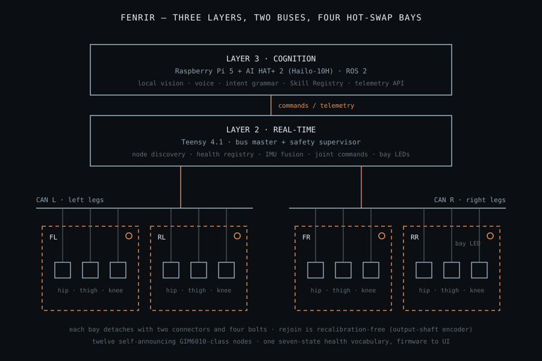

# FENRIR architecture

Block-diagram-level overview. Compiled 2026-07-17 from the private
development repository, **refreshed 2026-09-06**; implementation detail (wire
protocols, schemas, control internals) stays private until launch.

Layers 1 and 2 below are no longer purely design: four actuators are on the
bench and have been read, tested and configured. Where a statement is now
backed by a measurement it says so and links the note. Everything else remains
the plan.



## Three layers, one nervous system

**Layer 3 — Cognition.** Raspberry Pi 5 (8 GB) with the AI HAT+ 2
(Hailo-10H, 40 TOPS), running Ubuntu 24.04 and ROS 2 Jazzy. Everything AI
runs locally, on the robot: vision (YOLO26 during development, RF-DETR as
the license-clean deployment alternative; MediaPipe for pose and hands),
voice in (whisper.cpp), command understanding (FunctionGemma mapping
utterances into a versioned command grammar), voice out (Piper), scene
description on demand (Gemma-class VLM). A Skill Registry treats every
capability as a versioned, precondition-checked object, and a telemetry and
command API exposes the whole robot to UIs and the future SDK.

**Layer 2 — Real-time.** A Teensy 4.1 is the bus master and safety
supervisor. It owns node discovery, a per-joint health registry, IMU fusion,
and joint command distribution at control rate. It also drives the bay
status LEDs directly, so health is visible even if everything above it is
down. The robot never depends on the Pi to remain standing.

**Layer 1 — Actuation.** Twelve identical integrated smart actuators
(GIM6010-8 with the GDS68 driver and a secondary output-shaft encoder), one
per joint, as self-announcing nodes on two CAN buses split by body side.
The secondary encoder reports absolute joint position on power-up, which is
what makes hot-swap recalibration-free.

*Status:* four of the twelve are in hand. All four have been read, the encoder
claim above has been **tested on hardware and holds**
([2026-08-18](bringup/2026-08-18-hot-swap-position-verified.md)), and all four
have been configured out of their factory state
([2026-09-03](bringup/2026-09-03-first-configuration.md)). The remaining eight
are ordered after one complete leg is validated. The driver's firmware is a
vendor fork whose version number cannot be looked up against anything public,
which is why the system identifies an actuator by the shape of its parameter
tree rather than by what it calls itself
([2026-08-11](bringup/2026-08-11-first-contact.md)).

## The hot-swap module

Each leg is a module that detaches with **two connectors and four bolts**:
XT30 for power, JST-GH for the bus. Every rail is individually fused and
current-monitored. Pull a leg while the robot operates and the system
degrades gracefully; plug it back and discovery brings it home.

**One constraint, found by testing rather than assumed.** Position recovery is
absolute only *within one output revolution*. A joint rotated through more than
a full revolution while it is disconnected comes back believing it is one
revolution away from where it actually is — and it raises no error doing so,
because from the driver's point of view nothing went wrong. The remedy is
mechanical: hard stops that keep each joint's travel inside one revolution make
the condition physically unreachable. That is a design input to the leg and the
bay, not something to catch in software
([2026-09-03](bringup/2026-09-03-first-configuration.md)).

## One health vocabulary

Every component in the stack, from actuator firmware to UI status pill,
speaks exactly one seven-state machine
(see [`common/component_state.h`](../common/component_state.h)):

```
OFFLINE → DISCOVERED → CALIBRATING → READY → ACTIVE → DEGRADED → FAULT
```

There are no ad-hoc status strings anywhere. A lost heartbeat degrades the
joint and the gait reconfigures; a returning module walks the same lifecycle
as a booting one. "Self-announcing" holds at all three layers by a different
mechanism at each: on the ROS graph a node appears without being asked; on the
host link health changes are pushed on change rather than polled for; on the
CAN bus the actuators emit unprompted telemetry, with active polling kept as
the guaranteed fallback for anything that does not. The bay LEDs render this state machine in light: the
hot-swap demo narrates itself (pull a leg: red; plug it back: amber pulse
through calibration, then green).

## Verification culture

The rule that generates most of the others: **sim agrees with math before
hardware moves.** The kinematics in this repo are verified at machine
precision against closed forms and finite differences; the simulated robot's
foot positions must match the analytic solution to sub-micron before any
gait runs; every simulated rollout is checked against the actuators'
torque-velocity operating envelope and a sustained-torque thermal budget.
Message contracts are schema-versioned and append-only, with CI tests that
fail if any mirror of a shared enum drifts.

The same rule now runs in the other direction. Every claim about the actuators
is treated as unverified until a device confirms it, including claims taken
from the vendor's own documentation — which has been wrong about this part on
several specifics, among them the encoder resolution. The
[bring-up log](bringup/) records what each session actually measured, the
constraints that turned up alongside the results, and the occasions where the
correction was to our own reasoning rather than to anybody else's. See
[MILESTONES.md](MILESTONES.md) for what this has caught so far.
